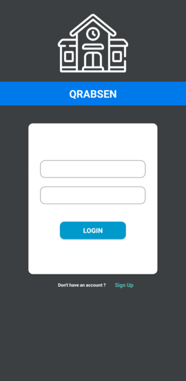
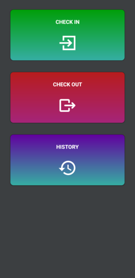
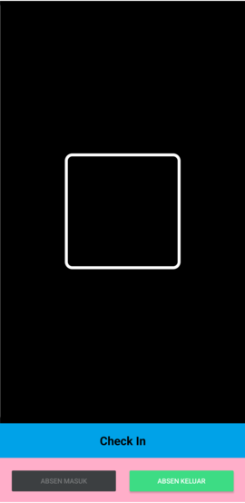
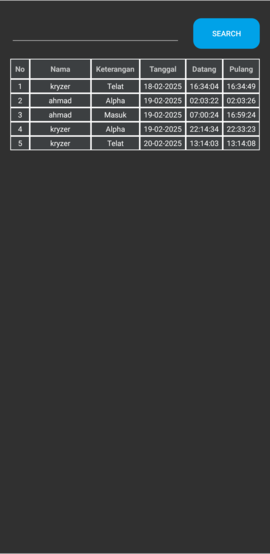

# Aplikasi Absensi QRCode berbasis android

Aplikasi Absensi yang menggunakan QRcode berbasis android merupakan sebuah proyek yang bertujuan untuk mengotomatisasi proses absensi di lingkungan sekolah menggunakan teknologi QR code. Aplikasi ini dikembangkan dengan menggunakan java dan didesain untuk mempermudah pengelolaan dan pencatatan kehadiran siswa.

## Fitur Utama
- **QR Code scanner.** Setiap siswa menunjukkan qr code kepada perangkat ponsel yang telah terinstall pada . Aplikasi akan memvalidasi QR code dan mencatat kehadiran siswa ke dalam database.
- **Dashboard petugas.** Guru atau petugas sekolah dapat dengan melihat kehadiran siswa.
  

## Fitur Yang Akan Datang
- **Fitur Dibawah Akan Di Tambah Pada Bagian Website / Backend**
  - **QR Code generator & downloader.** Guru atau petugas sekolah yang sudah login akan men-generate dan/atau mendownload qr code setiap siswa.
  - **Generate Laporan.** Generate laporan dalam bentuk pdf.
  - **Tambah, Ubah, Hapus(CRUD) data siswa/guru.**
  - **Tambah, Ubah, Hapus(CRUD) data kelas.**

> [!NOTE]
>
> ## Tools, Framework dan Library Yang Digunakan
>
> - [Laravel 11](https://laravel.com/)
> - Visual Studio Code
> - Android Studio
 
## Tampilan Aplikasi

### Halaman Login

### Halaman Dashboard

### Halaman QR Scanner

### Halaman History Absen

> [!NOTE]
> ## Cara Penggunaan
> - Untuk menjalankan aplikasi ini diperlukan backend restful API
> - untuk versi ini, halaman login hanya perlu menekan tombol login tanpa harus mengisi form login
> - untuk menghubungkan API dengan aplikasi, anda harus menekan logo pada halaman login sebanyak 5x
> - setelah itu anda dapat memasukan url + port (jika ada) untuk menghubungkan aplikasi dengan API
